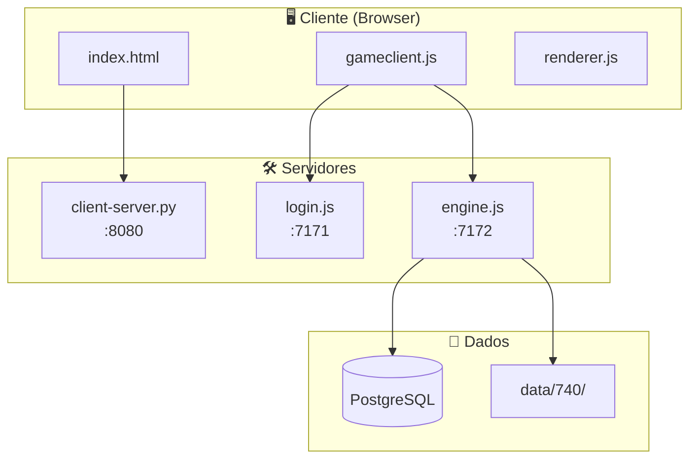

# 🏗️ Arquitetura do Tibia Browser Engine

## Visão Geral

O projeto é dividido em **3 componentes principais**:



## Componentes

### 1. Client Server (`client-server.py`)
- Servidor HTTP estático em Python
- Serve os arquivos do cliente (HTML/CSS/JS)
- Porta padrão: `8080`

### 2. Login Server (`login.js`)
- Autenticação de usuários
- Criação de personagens
- Porta padrão: `7171`

### 3. Game Engine (`engine.js`)
- Lógica principal do jogo
- Comunicação WebSocket com clientes
- Gerenciamento de mundo, criaturas, itens
- Porta padrão: `7172`

---

## Estrutura de Pastas

### `/client` - Frontend

```
client/
├── index.html           # Página principal
├── css/                 # Estilos
├── js/
│   ├── gameclient.js    # Cliente principal
│   ├── renderer.js      # Renderização canvas
│   ├── player.js        # Estado do jogador
│   └── ...
└── assets/              # Sprites, sons, etc.
```

### `/src` - Backend (Node.js)

```
src/
├── core/                # Núcleo do servidor
│   ├── gameserver.js    # Servidor principal
│   ├── world.js         # Gerenciador do mundo
│   └── ...
├── entities/            # Entidades do jogo
│   ├── creature.js      # Classe base de criaturas
│   ├── thing.js         # Classe base de objetos
│   ├── tile.js          # Tiles do mapa
│   └── ...
├── monster/             # Sistema de monstros
│   ├── monster.js       # Classe Monster
│   └── monster-behaviour.js
├── npc/                 # Sistema de NPCs
│   ├── npc.js           # Classe NPC
│   ├── npc-conversation-handler.js
│   └── ...
├── player/              # Sistema de jogadores
│   ├── player-properties.js
│   └── ...
├── combat/              # Sistema de combate
│   ├── spellbook.js     # Gerenciador de spells
│   └── ...
├── network/             # Comunicação de rede
│   └── protocol.js      # Packets
└── utils/               # Utilitários
```

### `/data/740` - Dados do Jogo

```
data/740/
├── actions/             # Interações com itens
│   ├── definitions.json # Lista de actions
│   └── definitions/     # Scripts JS das actions
├── spells/              # Magias
│   ├── definitions.json # Lista de spells
│   └── definitions/     # Scripts JS das spells
├── runes/               # Runas
│   ├── definitions.json # Mapeamento runa -> script
│   └── definitions/     # Scripts JS das runas
├── npcs/                # NPCs
│   ├── definitions.json # Posições e refs dos NPCs
│   └── definitions/     # JSONs + scripts dos NPCs
├── monsters/            # Monstros
│   ├── definitions.json # Mapeamento ID -> arquivo
│   └── definitions/     # JSONs dos monstros
├── conditions/          # Condições (poison, burn, etc.)
├── spawns/              # Spawns de monstros
└── world/               # Arquivos do mapa (.otbm)
```

---

## Fluxo de Comunicação

### Login Flow
```
1. Cliente abre index.html
2. Usuário entra com credenciais
3. Cliente envia para LoginServer (7171)
4. LoginServer valida no PostgreSQL
5. LoginServer retorna lista de personagens
6. Cliente conecta ao GameServer (7172)
```

### Game Flow
```
1. Cliente conecta via WebSocket ao GameServer
2. GameServer envia estado inicial (mapa, criaturas)
3. Cliente envia ações (movimento, ataque, fala)
4. GameServer processa e broadcast para jogadores próximos
5. Cliente atualiza interface
```

---

## Sistema de Módulos

O projeto usa um sistema customizado de `requireModule`:

```javascript
// Ao invés de caminhos relativos
const Player = require("../../entities/player");

// Usa-se requireModule com caminho a partir de /src
const Player = requireModule("entities/player");
```

Definido em `require.js`.

---

## Constantes Globais

Disponíveis globalmente via `CONST`:

```javascript
CONST.COLOR.RED       // Cores de texto
CONST.EFFECT.HEALING  // Efeitos mágicos
CONST.DIRECTION.NORTH // Direções
CONST.SLOT.HEAD       // Slots de equipamento
```

---

## Configuração

O arquivo `config.json` contém:

```json
{
  "SERVER": {
    "CLIENT_VERSION": "740",
    "HOST": "localhost",
    "PORT": 7172
  },
  "DATABASE": {
    "URL": "postgresql://..."
  }
}
```
